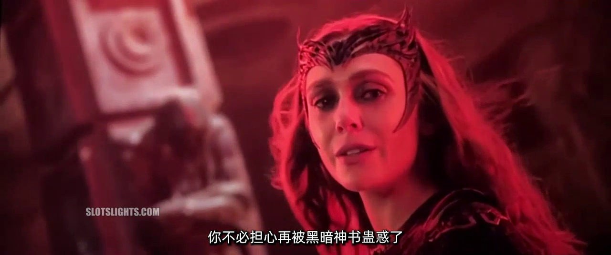
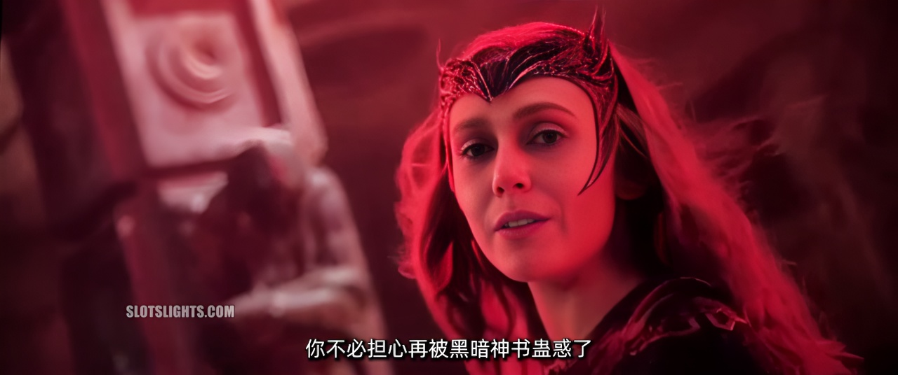
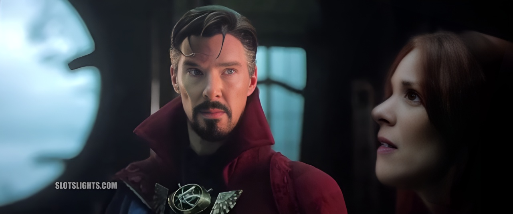
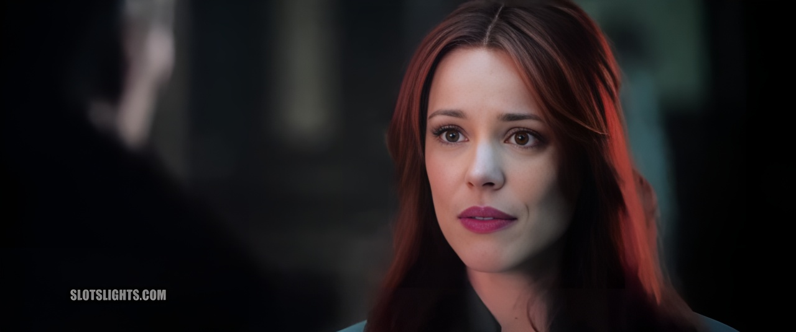

<p align="center">
  

<p align="center">
  

- **对比二**

<p align="center">
  

<p align="center">
  

- **对比三**

<p align="center">
  

<p align="center">
  

## Initial Requirements

- Python >= 3.7
- PyTorch >= 1.7
- NVIDIA GPU + CUDA (optional)

## Installation Guide


1. Create Cuda Virtual Environment
   ```bash
   conda create -n video python=3.7
   conda activate video
   ```

2. Install Cuda (only for Nvidia)

   ```bash
   conda install cudatoolkit=10.2
   conda install cudnn
   ```

3. 克隆项目

   ```bash
   git clone https://github.com/minnu03/human_face_restoration_using_GFPGAN.git
   cd project_code
   ```

4. 

   ```bash
   pip install numpy
   pip install torch==1.7.0
   pip install torchvision==0.8.0
   pip install basicsr
   pip install facexlib
   
   pip install -r requirements.txt
   python setup.py develop
   
   pip install realesrgan
   ```

## 下载预训练权重

- 下载权重文件：[GFPGANv1.3.pth](https://github.com/TencentARC/GFPGAN/releases/download/v1.3.0/GFPGANv1.3.pth)

下载好模型后放到项目`experiments/pretrained_models`目录下

## 视频转换

1. 在`video_rebuild`目录下，创建 src 目录；

2. 把需要修复的视频文件放到`video_rebuild/src`目录下；

3. 启动项目

   运行命令格式如下：

   ```bash
   python video_rebuild/main.py --video ./video_rebuild/src/<待修复视频> --save-path ./video_rebuild/result/<输出的视频>
   ```

   例如：

   ```bash
   python video_rebuild/main.py --video ./video_rebuild/src/demo04.mp4 --save-path ./video_rebuild/result/output.mp4
   ```

   - 如果需要保存每一帧的图像，可以在命令最后加上`--save-frame`，但是会使输出结果太大，不建议保存每一帧；

   - 输出的结果存储在项目`video_rebuild/result`目录下。


"""
 python -m http.server 8000
 streamlit run fe.py
"""

